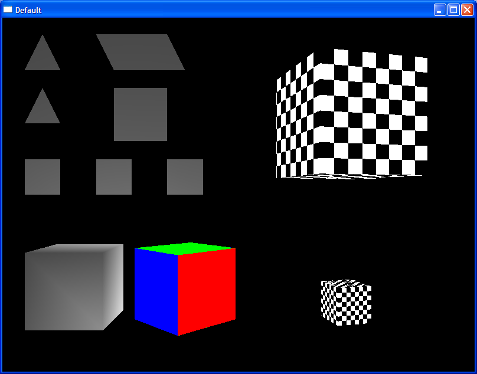

# C++ For Java Programmers

C++ for Java Programmers was a subject that was pretty much self-explanatory.
Most subjects in the LMIF used Java as the base programming language, so this
subject introduced some variety of the Clang kind.

## Content Omissions

### Practicals

There were practicals that contained code, but going back and trying to get them
to compile and run ended up sending me down more rabbit holes than I care to
delve deeper into. Too much [code rot][Software Rot].

### Assignments

I did have a second assignment that used [OpenGL][] to draw geometric shapes,
rotate them, and apply things like shading to them. Unfortunately, it was very
heavily tied to Windows platform libraries, and I am unable to run it on my
local machine and hence cannot confirm that the code still works.

But, here are some screenshots to give a taste of what each of its four stages
output:

[Software Rot]: https://en.wikipedia.org/wiki/Software_rot
[OpenGL]: https://www.opengl.org//
